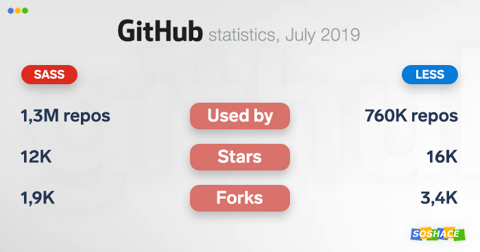
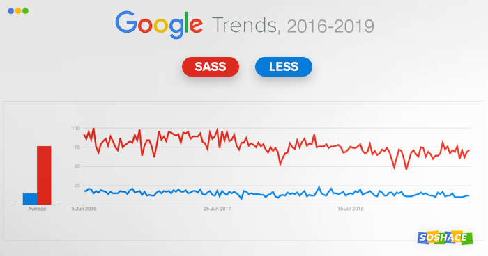
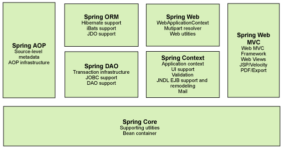

# 技术选型报告

## 开发环境

### Docker

我们使用Docker作为开发、测试、部署容器。

Docker 是一个开源的应用容器引擎，让开发者可以打包他们的应用以及依赖包到一个可移植的容器中,然后发布到任何流行的Linux机器或Windows 机器上,也可以实现虚拟化,容器是完全使用沙箱机制,相互之间不会有任何接口。

### Git

我们使用Git作为代码版本控制工具。

Git 是一个开源的分布式版本控制系统，用于敏捷高效地处理任何或小或大的项目。

Git 是 Linus Torvalds 为了帮助管理 Linux 内核开发而开发的一个开放源码的版本控制软件。

Git 与常用的版本控制工具 CVS, Subversion 等不同，它采用了分布式版本库的方式，不必服务器端软件支持。

## 开发工具统一

我们在技术选型的基础上，确定了各个开发工具的版本，并使用对应的包管理工具对相关软件和依赖的版本进行锁定。

下面是主要工具框架的版本信息：

- Python 3.7.5
- Django 2.2.9
- Node.js 10.16.3
- Vue 2.6.10

其余的依赖版本不在此处相依列出。

## 前端技术介绍

### 开发语言

#### HTML

HTML称为超文本标记语言，是一种标识性的语言。

它包括一系列标签．通过这些标签可以将网络上的文档格式统一，使分散的Internet资源连接为一个逻辑整体。HTML文本是由HTML命令组成的描述性文本，HTML命令可以说明文字，图形、动画、声音、表格、链接等。

HTML5是互联网的下一代标准，将Web带入一个成熟的应用平台，在这个平台上，视频、音频、图像、动画以及与设备的交互都进行了规范，还提供了地理定位、数据存储、多线程等新的功能。

#### CSS

层叠样式表(英文全称：Cascading Style Sheets)是一种用来表现HTML等文件样式的计算机语言。

CSS不仅可以静态地修饰网页，还可以配合各种脚本语言动态地对网页各元素进行格式化。CSS 能够对网页中元素位置的排版进行像素级精确控制，支持几乎所有的字体字号样式，拥有对网页对象和模型样式编辑的能力。CSS在Web设计领域是一个突破。利用它可以实现修改一个小的样式更新与之相关的所有页面元素。

#### JavaScript

JavaScript（简称“JS”） 是一种具有函数优先的轻量级，解释型或即时编译型的编程语言。

虽然它是作为开发Web页面的脚本语言而出名的，但是它也被用到了很多非浏览器环境中，JavaScript 基于原型编程、多范式的动态脚本语言，并且支持面向对象、命令式和声明式（如函数式编程）风格。

### 开发框架

#### Vue

Vue.js是一套构建用户界面的渐进式框架。

与其他重量级框架不同的是，Vue 采用自底向上增量开发的设计。Vue  的核心库只关注视图层，并且非常容易学习，非常容易与其它库或已有项目整合。另一方面，Vue  完全有能力驱动采用单文件组件和Vue生态系统支持的库开发的复杂单页应用。Vue.js 自身不是一个全能框架——它只聚焦于视图层。因此它非常容易学习，非常容易与其它库或已有项目整合。另一方面，在与相关工具和支持库一起使用时，Vue.js 也能完美地驱动复杂的单页应用。

#### React

React 起源于 Facebook 的内部项目，React的设计思想极其独特，是当下十分流行的框架。

因为该公司对市场上所有 JavaScript MVC 框架，都不满意，就决定自己写一套，用来架设Instagram 的网站，并在2013年5月开源了。React框架属于革命性创新，性能出众，代码逻辑却非常简单。React有以下特点：1.声明式设计：React采用声明范式，可以轻松描述应用。2.高效：React通过对DOM的模拟，最大限度地减少与DOM的交互。3.灵活：React可以与已知的库或框架很好地配合。

#### Angular

AngularJS诞生于2009年，由Misko Hevery 等人创建，后为Google所收购。是一款优秀的前端JS框架，已经被用于Google的多款产品当中。AngularJS有着诸多特性，最为核心的是：MVC（Model–view–controller）、模块化、自动化双向数据绑定、语义化标签、依赖注入等等。

AngularJS 是一个 JavaScript框架。它是一个以 JavaScript 编写的库。它可通过 <script 标签添加到HTML 页面。通过 指令 扩展了 HTML，且通过表达式绑定数据到 HTML。AngularJS 是以一个 JavaScript 文件形式发布的，可通过 script 标签添加到网页中。

### 测试框架

#### Jest

Jest 是 Facebook 推荐的测试框架。它是基于 Jasmine 的， Facebook 替换了 Jest 的大部分功能，并在其上添加了很多新功能。Jest 的 UI 既清晰又方便，而且提供了一种模拟大型模块的简便方法，用以提高测试速度。

#### Mocha

Mocha是JavaScript界中最受欢迎的一款单元测试框架。Mocha比较灵活，和更多的一些库结合使用。Mocha是比较年老的测试框架，在JavaScript界中更加广泛地使用。因此Mocha的community比较大，可参考的文献较多，测试过程中遇到一些问题，可以上网查一查可以获取不少的帮助。

### UI框架

#### ElementUI

ElementUI框架是一款由饿了么前端团队开发的开源UI框架，一经面世，就收获大量程序员的芳心。在github 上更是高达29.8k的star。ElementUI基于Vue框架，提供了大量视图组件，为开发PC端Web前端开发者提供了大量的便利。ElementUI的设计原则包括：

一致性 Consistency

    与现实生活一致：与现实生活的流程、逻辑保持一致，遵循用户习惯的语言和概念；
    在界面中一致：所有的元素和结构需保持一致，比如：设计样式、图标和文本、元素的位置等。

反馈 Feedback

    控制反馈：通过界面样式和交互动效让用户可以清晰的感知自己的操作；
    页面反馈：操作后，通过页面元素的变化清晰地展现当前状态。

效率 Efficiency

    简化流程：设计简洁直观的操作流程；
    清晰明确：语言表达清晰且表意明确，让用户快速理解进而作出决策；
    帮助用户识别：界面简单直白，让用户快速识别而非回忆，减少用户记忆负担。

可控 Controllability

    用户决策：根据场景可给予用户操作建议或安全提示，但不能代替用户进行决策；
    结果可控：用户可以自由的进行操作，包括撤销、回退和终止当前操作等。

#### Material Components

Material Design是一种视觉语言，它通过技术和科学的创新综合了良好设计的经典原理。Material Design是Google集中最优秀的设计师团队设计出来的一种面向全平台的设计规范，通过整合Google现有的技术和能力，再加上对跨设备界面与交互思考，结合卡片式设计，给出在不同设备上界面和体验都相对统一的设计解决方案。

Material Design包括Android，IOS和Web三种平台的实现，其中为Web端提供的框架和组件库最早是基于Google开发的Angular前端框架实现的，之后也推出了适应Vue和React框架的UI组件库。

#### AntDesign

AntDesign是一款蚂蚁金服团队开发的面向中后台产品UI/UX的设计规范与开发框架。一方面，作为设计规范的Ant Design，相比于MaterialDesign考量的设计原则和Material的隐喻而言只能说中规中矩，但对于它 “全面提高中台产品体验和研发效率” 的目标而言则做的相当不错；另一方面，框架与组件部分是Ant Design最大的亮点， 丰富的组件提供了覆盖中后台产品大部分应用场景的能力。

AntDesign最重要一点是提出了后台框架的理念，把一直为人们所忽视的后台设计提上了台面，并且给出了相当优秀的设计规范和框架。需要注意的是，AntDesign最初是基于React框架开发的，对React框架的适应性较好，尽管也提供Angular和Vue的组件库，但兼容性还不是十分令人满意。

### 开发插件

#### Vue-Router

Vue Router 是 Vue.js官方的路由管理器。它和 Vue.js 的核心深度集成，让构建单页面应用变得易如反掌。包含的功能有：

* 嵌套的路由/视图表
* 模块化的、基于组件的路由配置
* 路由参数、查询、通配符
* 基于 Vue.js 过渡系统的视图过渡效果
* 细粒度的导航控制
* 带有自动激活的 CSS class 的链接
* HTML5 历史模式或 hash 模式，在 IE9 中自动降级
* 自定义的滚动条行为

#### VueX

Vuex 是一个专为 Vue.js 应用程序开发的状态管理模式。它采用集中式存储管理应用的所有组件的状态，并以相应的规则保证状态以一种可预测的方式发生变化。Vuex 背后的基本思想，借鉴了 Flux 、Redux 和 The Elm Architecture 。与其他模式不同的是，Vuex 是专门为 Vue.js 设计的状态管理库，以利用 Vue.js 的细粒度数据响应机制来进行高效的状态更新。 也集成到 Vue 的官方调试工具 devtools extension ，提供了诸如零配置的 time-travel 调试、状态快照导入导出等高级调试功能。

#### Sass/Scss

Sass（英文全称：Syntactically Awesome Stylesheets）是一个最初由Hampton Catlin设计并由Natalie Weizenbaum开发的层叠样式表语言。在开发最初版本之后，Weizenbaum和Chris Eppstein继续通过SassScript来继续扩充Sass的功能。SassScript是一个在Sass文件中使用的小型脚本语言。

Sass是一个将脚本解析成CSS的脚本语言，即SassScript。Sass包括两套语法。最开始的语法叫做“缩进语法”，与Haml类似[3]，使用缩进来区分代码块，并且用回车将不同规则分隔开。而较新的语法叫做“SCSS”，使用和CSS一样的块语法，即使用大括号将不同的规则分开，使用分号将具体的样式分开。通常情况下，这两套语法通过.sass和.scss两个文件扩展名区分开。

#### Less

Less （Leaner Style Sheets 的缩写） 是一门向后兼容的 CSS 扩展语言。, 一门 CSS 预处理语言，它扩充了 CSS 语言，增加了诸如变量、混合（mixin）、函数等功能，让 CSS 更易维护、方便制作主题、扩充。Less 可以运行在 Node 或浏览器端。

#### ESLint

ESLint是一个用来识别 ECMAScript 并且按照规则给出报告的代码检测工具，使用它可以避免低级错误和统一代码的风格。ESLint被设计为完全可配置的，主要有两种方式来配置ESLint。

### 包管理工具

#### NPM

npm (node package manager)是 JavaScript 世界的包管理工具,并且是 Node.js  平台的默认包管理工具，也是世界上最大的软件注册表，每星期大约有 30 亿次的下载量，里面包含超过 600000 个  包的结构，能够使您轻松跟踪依赖项和版本。npm包括网站、注册表，用户可以直接通过cli命令行工具进行包管理。

#### YARN

Yarn是由Facebook、Google、Exponent 和 Tilde 联合推出了一个新的 JS 包管理工具 ，是为了弥补 npm 的一些缺陷而出现的。它替换了npm客户端或其他程序包管理器的现有工作流程，同时仍与npm注册表兼容。yarn具有与现有工作流程相同的功能集，同时可以更快，更安全，更可靠地运行。

### 微信小程序

#### MINA

MINA是微信小程序官方提供的默认框架，小程序开发框架的目标是通过尽可能简单、高效的方式让开发者可以在微信中开发具有原生APP体验的服务。

MINA框架提供了自己的视图层描述语言WXML和WXSS，以及基于JavaScript的逻辑层框架，并在视图层与逻辑层间提供了数据传输和事件系统，可以让开发者可以方便的聚焦于数据与逻辑上。MINA 提供的主要功能包括数据绑定、列表与条件渲染、模块化、路由，此外还支持微信所提供的一系列包括获取微信账户、定位、支付等外接功能。总体上说 MINA 的开发模式和 Vue 相近，具有轻量级、易上手的特点。

#### mpvue

全称为 mini program vue 即 Vue.js in mini program ,是由美团点评团队出品的基于Vue框架的小程序开发框架， 最初用于开发微信小程序，之后逐步扩展到支持百度小程序、头条小程序、支付宝小程序等许多小程序平台。该框架最大的优点是封装了小程序的编译器，可以直接把 Vue 框架的代码转换成小程序代码，大大降低了技术壁垒和对团队的要求。

## 前端方案比较

> 前端各种各样的技术选项很多，但是最主要的还是前端框架，要先选择框架，才能够根据框架特性去选择合适的UI框架和扩展。所以这里主要对Vue，React，Angular三者进行比较。

#### 方案一  Vue+ElementUI+VueRouter+Vuex

Vue.js的特征是：

1. **平滑的学习曲线**

   Vue平缓的学习曲线赢得了初学者和高级开发人员的欢心。我们在State of  Vue.js报告中调查过的开发人员都说，学习曲线是Vue引起众多开发人员兴趣的主要原因。在浏览完官方指南中包含的材料后，您就可以着手开发您的第一个Vue应用，而无需事先了解ES2015、typescript、JSX或其它前端框架。

   你只需要对Javascript、HTML和CSS有一个基本的理解就可以开始使用Vue来构建您的应用。当然如果您在使用框架方面有一些经验会更好，特别是您正在构建的是复杂的Web应用。

   Vue还减少了理解复杂代码所需的时间（这在Angular中很常见）。这一点对编写简单的Web应用特别方便。

2. **模块化、灵活的开发环境**

   Vue的Web应用是使用组件构建的。因为Vue已经根据项目需要为开发人员提供了许多灵活性和适应性，而且Vue的单文件组件是松散耦合的，这可以提高代码重用性，进而缩短了开发时间。

   基于组件的架构是构建将来有扩展需求的应用的理想选择。Vue要求构建大型应用时一开始就使用模块化来构建系统。但是Vue在这里也给了开发人员一些灵活性，因为Vue、Webpack或Browserify推荐的bundler具有稍后用您选择的预处理器转换源代码的能力。

3. **轻量级的本体和丰富的扩展**

   Vue以丰富的代码库和成套方便开发的工具，满足了开发人员的所有需求。这些有名的旨在提高编码体验的工具包括：用于状态管理的Vuex和用于路由管理的Vue-routing, 后者可以将单页应用程序的和对应的URL一一映射，让构建单页面应用变得易如反掌。

   Vue还有自己的官方调试工具 devtools ，它作为浏览器扩展的形式出现。devtools简化了应用程序调试和组件的状态和层次结构的检查。它允许实时编辑应用程序、跟踪自定义事件和跨时间点调试应用程序，以查看以前的版本和所做的更改。

这一套前端方案提供了包括框架、UI组件、页面路由管理、状态管理在内的的全部功能，VueRouter和Vuex很好地补充了Vue.js作为一款轻量级前端框架在功能上的缺失。

#### 方案二 React+AntDesign

React同样是一种简约的设计开发方式，包括以下特点：

1. **声明式**

   React 使创建交互式 UI 变得轻而易举。为你应用的每一个状态设计简洁的视图，当数据改变时 React 能有效地更新并正确地渲染组件。以声明式编写 UI，可以让你的代码更加可靠，且方便调试。

2. **组件化**

   创建拥有各自状态的组件，再由这些组件构成更加复杂的 UI。组件逻辑使用 JavaScript 编写而非模版，因此你可以轻松地在应用中传递数据，并使得状态与 DOM 分离。

3. **移植性**

   React 可以使用 Node 进行服务器渲染，或使用 React Native 开发原生移动应用。通过React Native平台，可通过相同的React组件模型为iOS和Android开发本机呈现的应用程序无论是Web还是本机移动开发，React都是大多数用户界面设计平台的理想选择。

通过引入AntDesign，可以将原本就长于交互与设计的React的优势放大。AntDesign提供普遍适合于大多数中后端产品应用场景的设计规范和组件库，在相关的业务场景中相比其他组件库覆盖面更广、设计整体性更强。

#### 方案三 Angular+Material Design

与Vue和React不同，Angular 是一个真正功能齐全的框架，支持 Model-View-Controller 模式，更具体地说是MVVM模式，非常适合构建动态的SAP（单页网络应用程序）。

Angular 的部分最好的功能：
1. **Model-View-ViewModel（MVVM）**

   为了构建客户端Web应用程序，Angular 将原始 MVC 软件设计模式背后的基本原理结合在一起。然而，Angular 没有实现传统意义上的 MVC，而是实现了  MVVM 即 Model-View-ViewModel 模式。

2. **依赖注入**

   Angular 带有内置的依赖注入子系统功能，这使得应用程序易于开发和测试。依赖注入允许开发者通过请求来获得依赖关系，而不是搜索依赖关系。这对开发人员非常有帮助。

3. **测试**

   在 Angular 中，可以单独对控制器和指令进行单元测试。Angular 允许开发人员进行端到端和单元测试运行器设置，这意味着也可以从用户角度进行测试。

4. **跨浏览器兼容**

   Angular 的一个有趣功能是，框架中编写的应用程序在多个浏览器都能运行良好。Angular 可以自动处理每个浏览器所需的代码。

5. **指令**

   Angular 的指令（用于渲染指令的DOM模板）  可用于创建自定义的 HTML 标记。这些是 DOM 元素上的标记，因为开发者可以扩展指令词汇表并制作自己的指令，或将它们转换为可重用组件。

6. **Deep Linking**

   由于 Angular 主要用于制作单页应用程序，因此必须利用 Deep Linking 功能才能在同一页面上加载子模板。Deep Linking 的目的是为了查看位置 URL 并安排它映射到页面的当前状态。

Material Design是Google提出的设计语言，提供面向全品台的设计结局方案，对Web来说，Material Design提供丰富的组件库，而其在Angular框架下的实现，针对Angular的特性进行了定向优化，比其他的框架性能上更优。

### 需求一致性分析

针对客户需求以及整个项目的周期等，分析业务场景具备如下特点：

1. **项目周期较短、工程量较小**

   好未来/未来之星项目主要分为两部分，基于Web的管理端和基于微信小程序的用户端，主要功能是记录和展示开班、课程、活动和校友信息，项目总周期为三周，开发团队为6人。项目本身不是很大，从这一点上说采用Angular作为本项目的前端框架有些大材小用，或者反过来说我们要做的只是一个小的、简单的程序，并不需要大型软件框架的复杂设计与功能，从这一点上说我们更倾向于选择Vue或React。

2. **业务场景更贴近中后台产品**

   用户对于本项目功能的期待是实现报名、⾯试、录取等流程的信息化和无纸化；增加活动线上报名的功能，方便收集报名信息；将线下课程的视频、ppt、速记等内容进⾏电⼦化留存；建⽴校友资料库，便于校友查询和联系等。可以看出，用户最迫切的需求是用管理端程序和微信服务平台辅助现有的线下课堂，本程序承担的功能更多的是填写、记录、显示信息和资料。管理端是典型的信息系统后台，而用户端的交互性也相对较弱，整体系统风格贴近中后台产品。在这一点上三种前端框架区别不大，而在UI框架上，Material Design的上限更高但相对难掌握，ElementUI 表现中规中矩，而Ant Design则更适合当前的业务场景。

3. **业务环境是PC端Web+微信小程序**

   本项目的管理端是基于PC端的Web实现的，移动端的实现基于微信小程序，在这一点上React框架最大的优势之一——通过 React Native 一次开发可以快速转化多平台产品就不那么明显了。反过来说微信小程序除了支持原生的MINA框架以外，还可以引入 mpvue 框架，即可以用 Vue 的方式开发微信小程序，这在业务上的简化和复用作用是不言而喻的，所以在业务环境这一点上 Vue 有着绝对的优势。

### 技术一致性分析

1. **团队成员技术情况**

   一方面，通过前期课程的学习，团队成员对于Vue.js框架有一定的了解，相对熟悉；另一方面，更为重要的是团队中部分成员在先前的开发中曾使用过 Vue-ElementUI-VueRouter 等技术工具，拥有一定的经验，采用Vue框架可以快速上手大大提高开发效率。

2. **作为二次开发项目**

   本项目先前的项目采用的PC端的前端框架是 Vue ，而微信小程序部分则也引入了 mpvue ，通过 Vue 的方式进行开发，从这个角度上说选择Vue作为我们的框架是非常合适的，能够最大程度上兼容以前的代码，也方便对原有的项目进行重构。

### 协议分析

## 结论

#### 框架选择——Vue.js+ElementUI+VueRouter+Vuex+mpvue

综合比较上述方案，重点考虑到业务环境、二次开发的延续性和团队的技术积累，我们最终决定采用 Vue.js+ElementUI+VueRouter+Vuex+mpvue 作为前端框架。

#### 测试工具—— Jest vs. Mocha

根据2018年的数据调查显示， Jest 和 Mocha 仍然是使用最多的测试工具，其次是 Jasmine； Mocha 作为较老的测试框架，一方面更成熟，很多问题都有了相应的解决方案，使用的广泛程度和知名度也更高；而 Jest 作为新兴的测试工具，针对 Jasmine 和 Mocha 这些更早的框架进行了学习和改造，吸收了上述测试工具优点的同时也针对现有的问题进行了改造和创新。故这里决定采用 Jest 作为测试框架。

#### CSS预处理工具—— Sass vs. Less

Sass 和 Less 都是比较流行的 CSS 预处理器，二者的功能不相上下，语法差异也不是很大。综合比较二者，Less更晚出现，参考了Sass，具有一定的优势；但总的来说Sass更为流行和常用，对于存在的问题可以参考的资料和文档也更多，所以最终决定选择Sass。

#### 包管理工具—— npm vs. yarn

yarn 相比于 npm 是更新的工具，完全兼容 npm 的注册表，并且能够针对 npm 存在的问题进行优化——最突出的问题是安装速度和版本统一控制，yarn通过并行安装和离线缓存大大加快了安装依赖的过程，并且Yarn 有一个锁定文件 (lock file) 来记录被确切安装上的模块的版本号，以确保拉取同一个项目依赖时拉取到的是同一版本的。尽管 npm5.0 中也针对上述问题进行了优化，但总的来说没有yarn做得好。最终我们决定选择 yarn 作为前端包管理工具。

## 后端技术介绍

### 开发语言

#### Python

Python 是一种广泛使用的解释型、高级编程、通用型编程语言。

Python 的设计哲学强调代码的可读性和简洁的语法，尤其是使用空格缩进划分代码块，而非使用大括号或者关键词，对于接触过其他语言的郁闷着来说可能会感觉很怪异。

相比于 C++ 或 Java，Python 让开发者能够用更少的代码表达想法。不管是小型还是大型程序，该语言都试图让程序的结构清晰明了。

总结来说，Python 的设计理念赋予了它简洁的语法，让使用者能很轻松地使用 Python 写出结构清晰的程序。因此使用 Python 来开发网站后台可以提高前期的开发效率。

#### Java

Java 是一种广泛使用的计算机编程语言，拥有跨平台、面向对象、泛型编程的特性，广泛应用于企业级 Web 应用开发和移动应用开发。

Java 不同于一般的编译语言或解释型语言。它首先将源代码编译成字节码，再依赖各种不同平台上的虚拟机来解释执行字节码，从而具有“一次编写，到处运行”的跨平台特性。

### 开发框架

#### Django

Django 是采用 Python 语言开发的 Web 框架。相比于其他的 Python Web 框架，Django 的功能可以说是非常完整的，它提供了服务发布、路由映射、模板引擎、ORM 数据处理的一整套功能。

但是这也意味着 Django 的各模块之间结合得比较紧密，所以在功能强大的同时又是一个相对比较封闭的系统。但是其健全的在线文档及开发社区使开发者在遇到问题时能及时找到解决方法。

Django 的优点有以下几个方面：

- 开发文档非常完善：经过多年的发展与积累，Django 有着广泛的应用和完善的在线文档，开发者在遇到问题时能够快速地从资料库中找到解决方法
- 集成数据访问组件：Django 的 Model 层自带了 ORM 组件，可以将数据模型快速地与数据库进行映射，提供了丰富的对象操作接口
- 管理后台自动生成：Django 提供了自带的数据管理系统，开发者只需进行相应的注册，就可以快速生成简单的数据管理系统。
- 具有表单序列化及验证系统，用于 HTML 表单和适于数据库存储的数据之间的转换。
- 具有缓存框架，并有几种缓存方式可供选择。
- 支持定义中间件，允许对请求处理的各个阶段进行干涉。
- 具有一个序列化系统，能够生成或读取采用 XML 或 JSON 表示的 Django 模型实例。
- 具有用于扩展模板引擎的能力的系统。

#### Spring Framework

Spring 框架是 Java 平台的一个开源的全栈应用程序框架和控制反转容器实现，一般被直接称为 Spring。

Spring 框架是一个分层架构，由 7 个定义良好的模块组成。Spring 模块构建在核心容器之上，核心容器定义了创建、配置和管理 bean 的方式，如下图所示。

该框架的一些核心功能理论上可用于任何 Java 应用，但 Spring 还为基于 Java 企业版平台构建的 Web 应用提供了大量的拓展支持。虽然 Spring 没有直接实现任何的编程模型，但它已经在 Java 社区中广为流行，基本上完全代替了企业级 JavaBeans 模型。

#### Spring Boot

Spring Boot 是由 Pivotal 团队提供的框架，其设计目的是用来简化新 Spring 应用的初始搭建以及开发过程。该框架使用了特定的方式来进行配置，从而使开发人员不再需要定义样板化的配置。

也就是说 Spring Boot 其实不是一个具有新功能的框架，它的作用只是将 Spring Framework 中的各个框架配置起来，减少开发人员的配置工作，使得 Spring Framework 具有了开箱即用的优点。

#### Mybatis

MyBatis 也是一个 Java 持久化框架，它通过 XML 描述符或注解把对象与存储过程或 SQL 语句关联起来。

与其他的对象关系映射框架不同，MyBatis 并没有将 Java 对象与数据库表关联起来，而是将 Java 方法与 SQL 语句关联。MyBatis 允许用户充分利用数据库的各种功能，例如存储过程、视图、各种复杂的查询以及某数据库的专有特性。如果要对遗留数据库、不规范的数据库进行操作，或者要完全控制 SQL 的执行，MyBatis 是一个不错的选择。

### 测试框架

#### JUnit

JUnit 是一个 Java 编程语言的单元测试框架。JUnit 在测试驱动的开发方面有很重要的发展，是起源于 JUnit 的一个统称为 xUnit 的单元测试框架之一。

它有以下优点：

- 支持基于注解的编程方式，简化项目配置
- 可以书写一系列的测试方法，对项目所有的接口或者方法进行单元测试。
- 启动后，自动化测试，并判断执行结果, 不需要人为的干预。
- 只需要查看最后结果，就知道整个项目的方法接口是否通畅。
- 每个单元测试用例相对独立，由Junit 启动，自动调用。不需要添加额外的调用语句。
- 添加，删除，屏蔽测试方法，不影响其他的测试方法。 开源框架都对JUnit 有相应的支持。

#### unittest

unittest 来自 Python 的标准库，使用简单、功能强大，日常测试需求均能得到很好的满足。在不引入第三方库的情况下，是单元测试的不二之选。

unittest 单元测试框架最早受到 JUnit 的启发，和其他语言的主流单元测试框架有着相似的风格。

它支持测试自动化，多个测试用例共享前置（setUp）和清理（tearDown）代码，聚合多个测试用例到测试集中，并将测试和报告框架独立。

### 包管理工具

#### Maven

Apache Maven，是一个软件项目管理及自动构建工具，由 Apache 软件基金会所提供。基于项目对象模型（缩写：POM）概念，Maven 利用一个中央信息片断能管理一个项目的构建、报告和文档等步骤。

#### pip

pip 是 Python 包管理工具，该工具提供了对 Python 包的查找、下载、安装、卸载的功能。目前官网提供的 Python 安装包中都内置了 pip 工具。

在开发中可以使用 pip 对 Python 软件包的依赖进行管理。

### 代码检查工具

#### PyLint

Pylint 是一个 Python 代码分析工具，它分析 Python 代码中的错误，查找不符合代码风格标准（Pylint 默认使用的代码风格是 PEP 8，具体信息，请参阅参考资料）和有潜在问题的代码。

#### 阿里巴巴代码规约插件

为了让开发者更加方便、快速将规范推动并实行起来，阿里巴巴基于手册内容，研发了一套自动化的IDE检测插件（IDEA、Eclipse）。该插件在扫描代码后，将不符合规约的代码按Blocker/Critical/Major三个等级显示在下方，甚至在IDEA上，还基于Inspection机制提供了实时检测功能，编写代码的同时也能快速发现问题所在。

## 后端方案比较

### 候选方案

我们综合考虑了以上提到的的技术，将其分成了两大类技术栈——Python 技术栈和 Java 技术栈。

从这两个技术栈中我们选出了以下两个解决方案：

#### 方案一

后端的方案一由以下技术组成：

- Python
- Django
- unittest
- pip

技术协议：

|   名称   |                         协议                         |
| :------: | :--------------------------------------------------: |
|  Django  | https://github.com/django/django/blob/master/LICENSE |
| unittest |                     MIT License                      |
|   pip    |                     MIT License                      |

很明显，这是由 Python 技术栈组成的方案。Python 语言提供了简单的语法，可以提高程序的开发效率。在协议方面也没有商业用途的限制。

测试框架 unittest 是参考了 JUnit 设计的，它的设计风格与 JUnit 非常地相似，因此使用过JUnit的开发者也能可以快速上手 unittest 框架。

与之配套的包管理工具是 pip 。 pip 可以很好地对 Python 软件包进行管理，包括安装、升级、卸载等操作，基本上可以满足开发中的依赖管理。

#### 方案二

后端的方案二由以下技术组成：

- Java
- Spring Boot
- Mybatis
- Junit
- Maven

技术协议：

| 名称             | 协议                           |
| ---------------- | ------------------------------ |
| Spring Framework | Apache License 2.0             |
| Spring MVC       | Apache License 2.0             |
| Spring Boot      | Apache License 2.0             |
| Mybatis          | Apache License 2.0             |
| Junit            | Eclipse Public License - v 1.0 |
| Maven            | Apache License 2.0             |

MyBatis 是一款优秀的持久层框架，它支持定制化 SQL、存储过程以及高级映射。MyBatis 避免了几乎所有的 JDBC 代码和手动设置参数以及获取结果集。

测试框架我们选择了使用较多的 JUnit，JUnit 是 Java 应用开发中很常用的的单元测试工具，从它的名字就能看出来它就是专门为单元测试而生的，它的优点在前面也已经介绍的很详细了。

与 Java 配套的包管理是 Maven。Maven 能够帮助我们完成我们所需的功能，而且实际上 Maven 也被大多数的开源库分发方式所支持，因此我们选择 Maven 作为我们的依赖管理工具。

### 需求一致性分析

首先，我们考虑到项目的类型是商业项目，因此在做出技术选型时需要考虑项目的后期的可维护性。我们认为 Spring 框架作为时下热门的方案，在开发人员的后续选择更有优势。

### 技术一致性分析

作为候选的 Python 和 Java 方案都可以跨平台运行，因此在我们组内的各个成员的电脑上都能很好地进行开发、运行。

我们可以使用 pip 工具对 Python 包版本进行控制，使用 Maven 对 Java 项目依赖进行控制，使用 npm 对 node 的包版本进行限制，并且将每个包的版本写入到项目配置文件中，保证每个成员使用的包版本是一致的。

## 结论

考虑到我们小组成员的已有技术，以及当前基于二次开发的项目情况，最终我们决定选择方案一作为后端的开发框架，即：

- Python
- Django
- unittest
- pip

我们认为这套选型方案可以带给我们很高的开发效率。